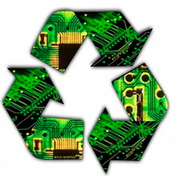

## ¿Cómo podemos garantizar la protección del medio ambiente?

Es importante que seamos consumidores responsables y no compremos de forma masiva, debemos reciclar, reutilizar y reducir.
Para ello es aconsejable:
- Elegir el dispositivo mas conveniente para nuestras necesidades.
- Ahorro de energía.
- Reutilizar cuando sea posible.
- Y reciclar cuando dejen de funcionar extrayendo las piezas que podamos salvar para utilizarlas en otro dispositivo.

